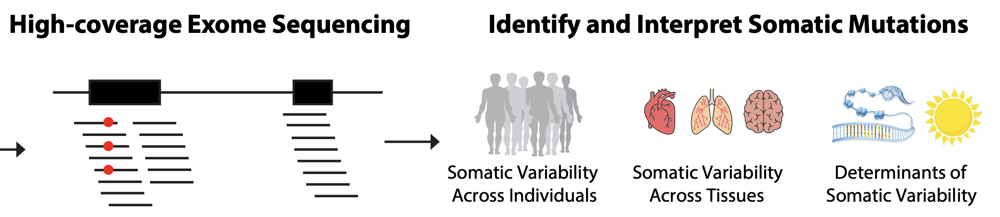
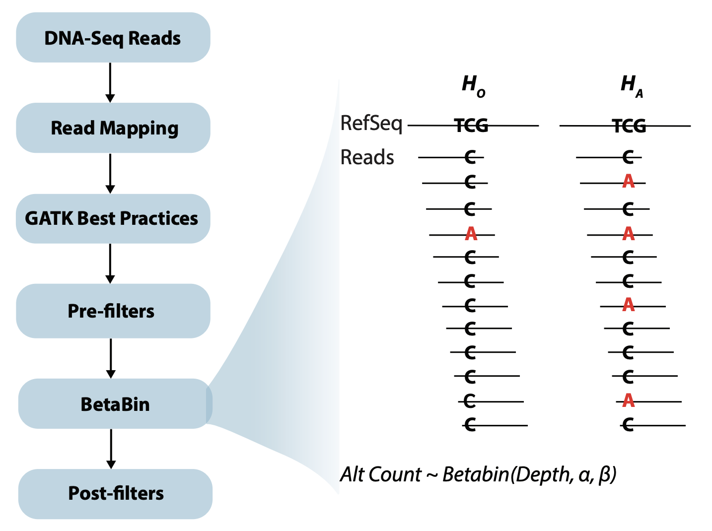

## mSOMA: Somatic Mutation Detection across multiple tissues using a betabinomial null model
Software supporting BioRxiv preprint: https://doi.org/10.1101/2025.01.07.631808







## Installation
mSOMA is implemented as a python package, but makes subprocess calls to external dependencies such as samtools, and uses an R script for MLE calculation.
mSOMA currently only works on linux and mac amd64 architectures, because it depends on [bamutil](https://anaconda.org/bioconda/bamutil) which only runs on those platforms.

The recommended way to install mSOMA is from [bioconda](https://anaconda.org/bioconda/msoma) with the below command, otherwise building using the Docker image is possible, instructions below:

`conda create --name msoma_env -c bioconda -c conda-forge msoma`

Then activate the environment with:

`conda activate msoma_env`

Then ensure `mSOMA` has access to the appropriate dependencies run:
`msoma check-dependencies`

Which should output:
```bash
$ msoma check-dependencies
Dependency found   external : Rscript: path: /path/to/.conda/envs/test_env/bin/Rscript
Dependency found   external : samtools: path: /path/to/.conda/envs/test_env/bin/samtools
Dependency found   external : bam: path: /path/to/.conda/envs/test_env/bin/bam
Dependency found   external : awk: path: /usr/bin/awk
Dependency found   R-library: survcomp
Dependency found   R-library: data.table
Dependency found   R-library: VGAM
Dependency found   R-library: argparse
Dependency found   R-library: bbmle
Dependency found   R-library: tidyverse
Dependency found   R-library: Biostrings
Dependency found   R-library: dplyr
Dependency found   R-library: qvalue
```

After installation, `msoma` has a CLI you can access to get help:
```
$ msoma
Usage: msoma [OPTIONS] COMMAND [ARGS]...

  cli for mSOMA functionality

Options:
  --version   Show the version and exit.
  -h, --help  Show this message and exit.

Commands:
  check-dependencies  Check if dependencies are installed and return...
  count               Create counts file from BAM file for somatic...
  merge-counts        Merge count files into a single count file
  mle                 Calculate p-values for each locus using maximum...
```

First `msoma count` should be run on the input `bam` file. There are many parameters, but sensible defaults.
```
$ msoma count --help                                                                                                                    
Usage: msoma count [OPTIONS] INPUT_BAM                                                                                                                                      
                                                                                                                                                                            
  Create counts file from BAM file for somatic variant calling Use samtools                                                                                                 
  and bamUtils piped implementation                                                                                                                                         
                                                                                                                                                                            
Options:                                                                                                                                                                    
  --fasta PATH                    Path to reference fasta file  [required]                                                                                                  
  -o, --output TEXT               Path to write counts file                                                                                                                 
  -L, --bed PATH                  Path to bed file for callable regions                                                                                                     
                                  [required]
  -l, --seq-length INTEGER        Read length  [required]                                                                                                                   
  -q, --min-MQ INTEGER            Minimum mapping quality                                                                                                                   
  -f, --require-flags INTEGER     Require bitwise SAM flags
  -F, --exclude-flags INTEGER     Exclude bitwise SAM flags
  -n, --ntrim INTEGER             Number of bases to trim from both ends of
                                  the reads
  -I, --max-indel INTEGER         Maximum number of indel bases allowed in a
                                  read
  -m, --mismatch-frac FLOAT       Maximum fraction of mismatch bases allowed
                                  in a read
  -s, --softclip-frac FLOAT       Maximum fraction of softclipped bases
                                  allowed in a read
  -b, --min-BQ INTEGER            Minimum base quality for pileup
  -d, --min-depth INTEGER         Minimum depth for pileup
  -a, --max-alt-allele INTEGER    Maximum number of alternate alleles allowed
                                  per locus
  -N, --qname-whitelist PATH      Path to QNAME whitelist file, only reads
                                  with QNAMEs in this file will be counted
  -m, --mpileup-intermediate PATH
                                  Path to write intermediate mpileup file for
                                  debugging, default is to not write
  -h, --help                      Show this message and exit.
```

Then the `msoma mle` command that makes use of the count file created by `msoma count` and
creates a `.pval` and `.abs` file:
```
$ msoma mle --help
Usage: msoma mle [OPTIONS] INPUT_COUNTS

  Calculate p-values for each locus using maximum likelihood estimation from
  counts file

  NOTE uses an Rscript included as package-data in msoma

Options:
  -o, --output PATH        Path to write p-value output file  [required]
  -d, --min-depth INTEGER  Minimum read depth to consider locus for p-value
                           calculation  [required]
  -a, --ab TEXT            Output file to write alpha and beta parameter
                           estimates  [required]
  -h, --help               Show this message and exit.
```

For a concrete example, look at the `run_w_conda.sh` script in the `examples` folder of this repo which includes example bam data.
This is a shell script that assumes you already have `msoma` installed and available on your path.

The is also an example for running `mSOMA` on a SLURM cluster with the nextflow workflow management tool in `run_SLURM_example.sh`

## Building with Docker

To run pytests locally that require external dependencies, `like samtools`,
use docker to first build the image with the "test" target:
```bash
docker build -t msoma-test --target test .
```
Then run the tests with the following command:
```bash
docker run --rm msoma-test
```

The `docker build` command can take ~30 minutes to complete to first time, but the installation of the dependencies is cached for subsequent builds.

The GHA workflow yaml does this steps.
